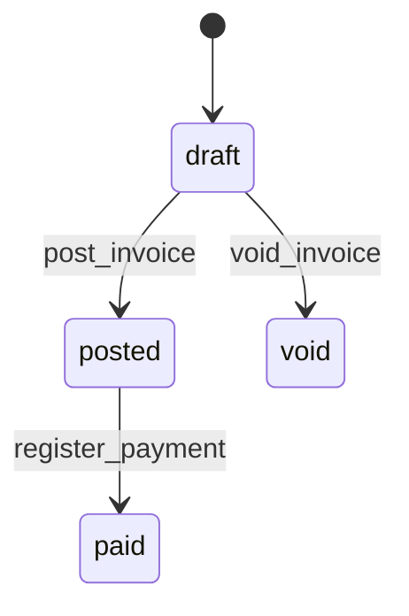

<div align="center">

# OpenERP

**The ERP whose primary operator is an AI agent — and whose books cannot be wrong by construction.**

[](LICENSE)
[](crates/ol-sdk)
[](https://www.rust-lang.org/)
[](https://modelcontextprotocol.io)
[](#what-works-today)
[](#build-it-with-us)

*Double-entry-correct by construction · every state change a typed, idempotent capability · every figure traceable to an append-only event log.*

**A duplicate journal entry here is not a bug to catch — it is impossible to create.**

</div>

---

## The inversion

Every legacy ERP — SAP, Oracle, even Odoo — works the same way: a human clicks through a UI, and the database *trusts the UI* to keep the books straight. Decades of bugs, reconciliation nightmares, and audit theatre flow from that single misplaced trust.

**OpenERP inverts it.** The **AI agent is the primary operator**, driving the ledger through a typed [MCP](https://modelcontextprotocol.io) capability surface — and correctness is enforced *in the database*, where it cannot be bypassed by any client, human or machine.

You don't *hope* the books balance. They **cannot** not-balance.

## Correctness you cannot violate

These aren't features. They're invariants — physically enforced, not politely requested:

- ⚖️ **Double-entry, enforced in PostgreSQL.** Every entry has ≥2 lines and `Σdebits = Σcredits`, checked by a deferred constraint trigger at commit. The application layer is *defense in depth*, never the only guard.
- 🔒 **Append-only.** No `UPDATE`, no `DELETE` on the ledger — triggers forbid it. Corrections are reversing entries. History is immutable.
- 🔁 **Idempotent by construction.** Every state-changing capability takes an `idempotency_key`; a `UNIQUE (operation, idempotency_key)` constraint makes a duplicate post *physically impossible*. **Ran twice ≠ paid twice.**
- 📜 **Audit-log-first.** An append-only `events` table records actor, capability, inputs hash, and resulting entries — machine-legible, replayable, training-corpus-grade.
- 💶 **Money is integer cents.** No floats. Ever.

The posting engine is property-tested *and* hammered with concurrent races (12 writers on one idempotency key → exactly one entry; 15 writers contending the same accounts → not one lost post). Correctness is the entire credibility surface, so we treat it that way.

## Agent-native, human-respected

The agent acts; the human watches, approves, and steps in — both over the *same* typed API, the same scoped OAuth, the same audit trail. Every business workflow is a version-controlled state machine in plain YAML, so "what is this invoice allowed to do next?" has one answer, and it's diffable:



That diagram isn't hand-drawn — it's **generated from the workflow's YAML source of truth**, so the human view of a process can never drift from what the engine actually enforces.

## Rust at the core, polyglot at the edges

This is a deliberate contributor bargain, not a purity test:

- 🦀 **Rust where it earns its place** — the posting engine, the invariant-enforcing core, the event store. Performance, memory safety, and compile-time correctness are non-negotiable *there*.
- 🐍🟦 **Python & TypeScript where you live** — the MCP server speaks a language-agnostic protocol, the SDKs ship in **Python and TypeScript first**, and the web UI is React. Integrating, scripting, and extending OpenLedger **never requires writing Rust.**

It's the pattern the best open engines already use — a fast, safe core wrapped in accessible clients (AppFlowy's Rust core + Flutter UI; Zoo/KittyCAD's Rust core + TypeScript app). **Contributions in Python and TypeScript are first-class.** Bring your stack.

## What works today

Honest status — this is early, and we're building in the open:

| Component | State |
|---|---|
| `ol-domain` — double-entry invariants | ✅ implemented + property-tested |
| `migrations` — schema + DB-enforced invariants | ✅ done (balance + append-only triggers) |
| `ol-ledger` — posting engine (`post_journal_entry`, balances) | ✅ done, concurrency- & adversarially-reviewed |
| `ol-process` — workflow YAML → diagram | ✅ in review |
| `ol-api` — REST + OpenAPI · `ol-sdk` — typed errors | 🚧 in progress |
| `ol-mcp` — MCP server + OAuth 2.1 · `apps/ol-ui` — React web app | 🔜 next |

There is **no running app yet** — the nearest you can drive today is the ledger crate and (soon) the `ol post` CLI. We're not going to pretend otherwise. What *is* real is the part that's hardest to retrofit: a correct, concurrent, audit-replayable core.

## Build it with us

This is the moment to get in — the foundation is laid, the hard correctness problems are solved, and the surface area where **you** can ship something visible is wide open.

**Good first issues** (no Rust required for several):
- 🎨 Scaffold the React + Vite + TS web UI (`apps/ol-ui`)
- 🔄 Render the live workflow view (Mermaid from `processes/*.yaml`)
- 💱 `formatMoney(cents, currency, locale)` — integer cents, locale-correct, zero float math
- 🌍 i18n scaffold (FR / DE / EN)
- 🧩 Build the Python / TypeScript SDKs from the OpenAPI spec

→ Browse [`good first issue`](https://github.com/Pher217/openerp/labels/good%20first%20issue) · read [CONTRIBUTING.md](CONTRIBUTING.md) (DCO sign-off) · meet the [maintainers](MAINTAINERS.md) · see the [roadmap](ROADMAP.md).

```bash
git clone https://github.com/Pher217/openerp && cd openerp
cargo test --all          # the core, green
# DATABASE_URL=postgres://… cargo run -p ol-cli -- migrate   # (soon)
```

We're looking for **≥3 maintainers**, especially anyone with real double-entry / accounting depth. If correctness-by-construction and agent-native software is your fight, [open an issue and say hi](https://github.com/Pher217/openerp/issues).

## Scope (v0.1)

**Ships:** chart of accounts, journals & general ledger, AR/AP (customers, vendors, bills, payments), basic inventory (items, stock moves, valuation), invoicing, audit trails.
**Deliberately out:** manufacturing/MRP, payroll, HR, CRM, multi-entity consolidation, VAT/e-invoicing regimes, multi-currency. We ship the 20% that covers 80% — correct — before we ship breadth.

## Workspace layout

```
crates/
  ol-domain/    double-entry invariants (AGPL-3.0)
  ol-ledger/    posting engine, SQLx hot path, idempotency (AGPL-3.0)
  ol-events/    event store + projections/replay (AGPL-3.0)
  ol-process/   workflow YAML → state machine + Mermaid (AGPL-3.0)
  ol-api/       Axum REST + OpenAPI (AGPL-3.0)
  ol-mcp/       MCP server, OAuth 2.1 PKCE, scoped tokens (AGPL-3.0)
  ol-sdk/       typed client SDK — Rust; Python/TS SDKs generated from OpenAPI (MIT OR Apache-2.0)
  ol-cli/       `ol serve|migrate|replay|post` (AGPL-3.0)
apps/ol-ui/     React + Vite web app — observe & operate (AGPL-3.0)
migrations/     SQL schema + double-entry triggers
processes/      business-process source-of-truth (YAML)
```

## Stack

Rust · Axum 0.8 / Tokio · SQLx 0.8 (hot ledger path) + SeaORM 1.1.x (CRUD) · `rmcp` 1.7 MCP server · PostgreSQL · React + Vite web UI · OpenAPI 3.1 (utoipa) → Python/TS clients.

## Kin & prior art

Not foils — fellow travellers on the ledger-as-event-log thesis: [TigerBeetle](https://github.com/tigerbeetle/tigerbeetle), [Formance Ledger](https://github.com/formancehq/ledger), Modern Treasury, Beancount. Our edge is the **agent-native capability surface + idempotency-by-construction + a polyglot contributor base.**

## Licensing

Core / server / API / MCP / UI / CLI: **AGPL-3.0**. SDK: **MIT OR Apache-2.0**. Contributions require a [DCO](CONTRIBUTING.md) sign-off.

---

<div align="center">
<sub>Correct by construction. Agent-native by design. Open by default.</sub>
</div>
