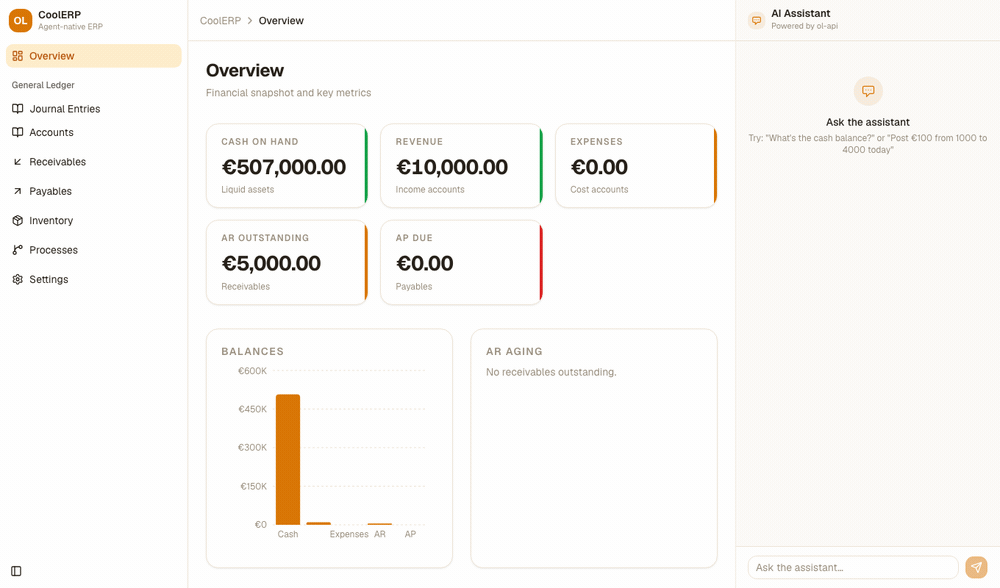
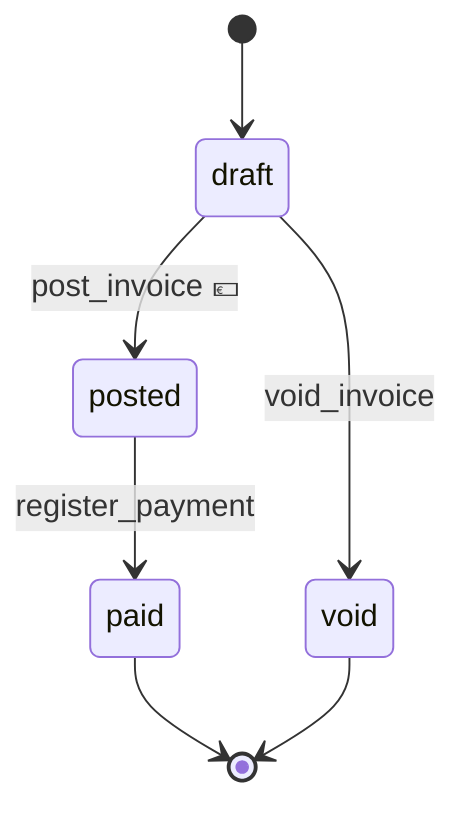

<div align="center">

# CoolERP

**The ERP whose primary operator is an AI agent — and whose books cannot be wrong by construction.**

[](https://github.com/Pher217/CoolERP/actions/workflows/ci.yml)
[](LICENSE)
[](crates/ol-sdk)
[](https://www.rust-lang.org/)
[](https://modelcontextprotocol.io)
[](#what-works-today)
[](#build-it-with-us)

*Double-entry-correct by construction · every state change a typed, idempotent capability · every figure traceable to an append-only event log.*

**A duplicate journal entry here is not a bug to catch — it is impossible to create.**

</div>

## Demo



*Overview KPIs → post a balanced journal entry through the UI → the ledger, cash and
revenue update → the six business processes, each a state machine generated from its
YAML source.* Recorded against a live `ol-api` and Postgres; the entry posted in the
clip is real and the figures move because the ledger actually changed.

<p align="center">
  <b>▶ <a href="docs/claude-desktop.md">Drive the same ledger from Claude Desktop</a></b> — the agent-native demo
  · <sub><a href="docs/adr/README.md">Architecture &amp; design rationale</a></sub>
</p>

---

## The inversion

Every legacy ERP — SAP, Oracle, even Odoo — works the same way: a human clicks through a UI, and the database *trusts the UI* to keep the books straight. Decades of bugs, reconciliation nightmares, and audit theatre flow from that single misplaced trust.

**CoolERP inverts it.** The **AI agent is the primary operator**, driving the ledger through a typed [MCP](https://modelcontextprotocol.io) capability surface — and correctness is enforced *in the database*, where it cannot be bypassed by any client, human or machine.

You don't *hope* the books balance. They **cannot** not-balance.

## Correctness you cannot violate

These aren't features. They're invariants — physically enforced, not politely requested:

- ⚖️ **Double-entry, enforced in PostgreSQL.** Every entry has ≥2 lines and `Σdebits = Σcredits`, checked by a deferred constraint trigger at commit. The application layer is *defense in depth*, never the only guard.
- 🔒 **Append-only.** No `UPDATE`, no `DELETE` on the ledger — triggers forbid it. Corrections are reversing entries. History is immutable.
- 🔁 **Idempotent posting.** Journal posting and inventory receipt take a client `idempotency_key` bound to a canonical hash of the request: a `UNIQUE (operation, idempotency_key)` constraint makes a duplicate post *physically impossible*, and reusing a key with a **different** payload is rejected rather than silently replayed. **Ran twice ≠ paid twice.** Starting a process instance does not yet take a key — a retried `start_process` creates a duplicate instance ([#54](https://github.com/Pher217/CoolERP/issues/54)).
- 📜 **Audit-log-first.** An append-only `events` table records actor, capability, inputs hash, and resulting entries — the actor is client-asserted on the ledger path and a per-surface constant (`api`/`mcp`/`ai-chat`) on process advances until auth lands ([#9](https://github.com/Pher217/CoolERP/issues/9)) — machine-legible, replayable, training-corpus-grade.
- 💶 **Money is integer cents.** No floats. Ever.

The posting engine is property-tested *and* hammered with concurrent races (12 writers on one idempotency key → exactly one entry; 15 writers contending the same accounts → not one lost post). Correctness is the entire credibility surface, so we treat it that way.

## Agent-native, human-respected

The agent acts; the human watches, approves, and steps in — both over the same typed API and the same audit trail. Scoped OAuth for the MCP and REST surfaces is designed in [docs/adr/0006-mcp-auth-cimd-over-rfc7591.md](docs/adr/0006-mcp-auth-cimd-over-rfc7591.md) but not yet wired; the API currently runs unauthenticated in dev mode. See [SECURITY.md](SECURITY.md). Every business workflow is a version-controlled state machine in plain YAML, so "what is this invoice allowed to do next?" has one answer, and it's diffable:



💶 marks a transition that writes to the append-only ledger; `--> [*]` marks a terminal state. Both
are derived from the YAML, not annotated by hand.

Each arrow is an MCP capability the agent calls — not a UI click — and each one carries the
guards and posting rule from the same YAML, enforced again by a database trigger at commit:

| capability | guards | posts |
|---|---|---|
| `post_invoice` | `lines_nonempty`, `totals_balance` | DR `accounts_receivable` / CR `sales_revenue` + `tax_payable` |
| `register_payment` | — | **none declared** — `customer_invoice.yaml` sets no `posting_rule`, and the engine posts only where one exists ([`ol-engine/src/lib.rs:469`](crates/ol-engine/src/lib.rs)), so this transition marks the invoice paid without clearing AR ([#110](https://github.com/Pher217/CoolERP/issues/110)) |
| `void_invoice` | — | none — reachable only from `draft`, before money has moved |

That diagram isn't hand-drawn — it's the literal output of [`Process::to_mermaid`](crates/ol-process/src/lib.rs),
**generated from the workflow's YAML source of truth** ([`processes/customer_invoice.yaml`](processes/customer_invoice.yaml)),
so the human view of a process can never drift from what the engine actually enforces.

## Rust at the core, polyglot at the edges

This is a deliberate contributor bargain, not a purity test:

- 🦀 **Rust where it earns its place** — the posting engine, the invariant-enforcing core, the event store. Performance, memory safety, and compile-time correctness are non-negotiable *there*.
- 🐍🟦 **Python & TypeScript where you live** — the MCP server speaks a language-agnostic protocol, the OpenAPI 3.1 spec is published at `/api-docs/openapi.json`, and the web UI is React. Integrating with CoolERP, scripting it, and adding new business processes (plain YAML in [`processes/`](processes/)) **never requires writing Rust** — adding a new server-side capability still does. The Python and TypeScript SDKs are meant to be generated from that spec; **neither exists yet**, and they are the two flagship good-first-issues ([#60](https://github.com/Pher217/CoolERP/issues/60), [#59](https://github.com/Pher217/CoolERP/issues/59)).

These architectural choices are recorded in [docs/adr/README.md](docs/adr/README.md).

It's the pattern the best open engines already use — a fast, safe core wrapped in accessible clients (AppFlowy's Rust core + Flutter UI; Zoo/KittyCAD's Rust core + TypeScript app). **Contributions in Python and TypeScript are first-class.** Bring your stack.

## What works today

Honest status — this is early, and we're building in the open:

| Component | State |
|---|---|
| `ol-domain` — double-entry invariants | ✅ implemented + property-tested |
| `migrations` — schema + DB-enforced invariants | ✅ done (balance + append-only triggers) |
| `ol-ledger` — posting engine (`post_journal_entry`, balances) | ✅ done, concurrency- & adversarially-reviewed |
| `ol-process` — workflow engine (`processes/*.yaml` → state machine + Mermaid) | ✅ done |
| `ol-api` — REST + OpenAPI | ✅ works |
| `ol-mcp` — MCP server | ✅ works; authentication is designed but not wired — it runs unauthenticated, and there is no authenticated mode to switch on (see [SECURITY.md](SECURITY.md)) |
| `apps/ol-ui` — React web app | ✅ works |
| `ol-engine` — process instances, transitions, posting rules | ✅ done |
| `ol-auth` — EdDSA JWT, Argon2id, scopes | ⚠️ implemented and unit-tested, but **no crate depends on it** — the auth primitives exist, the flow does not ([#9](https://github.com/Pher217/CoolERP/issues/9)) |
| `ol-sdk` — shared error envelope (Rust) | ✅ used by `ol-api`/`ol-mcp`; the Python/TS client SDKs do not exist yet ([#59](https://github.com/Pher217/CoolERP/issues/59), [#60](https://github.com/Pher217/CoolERP/issues/60)) |
| `ol-events` — event store + replay | 🚧 **empty stub, nothing depends on it.** The append-only `events` table is real, but it is written directly by `ol-ledger`; replay is not implemented and the table has no read endpoint ([#57](https://github.com/Pher217/CoolERP/issues/57)) |

You can run the app locally today; the core is solid and the quickstart below will get you a ledger, API, and UI in minutes.

## Quickstart

```bash
docker compose up -d db
make demo
make api
```

Then, in a second terminal:

```bash
make ui
```

## Build it with us

This is the moment to get in — the foundation is laid, the hard correctness problems are solved, and the surface area where **you** can ship something visible is wide open.

**Good first issues** (no Rust required for several):
- 🌍 i18n scaffold (FR / DE / EN)
- 🧩 Build the Python / TypeScript SDKs from the OpenAPI spec

→ Browse [`good first issue`](https://github.com/Pher217/CoolERP/labels/good%20first%20issue) · read [CONTRIBUTING.md](CONTRIBUTING.md) (DCO sign-off) · meet the [maintainers](MAINTAINERS.md) · see the [roadmap](ROADMAP.md).

```bash
git clone https://github.com/Pher217/CoolERP && cd CoolERP
cargo test --all          # the core, green
DATABASE_URL=postgres://… cargo run -p ol-cli -- migrate   # apply the schema
```

We're looking for **≥3 maintainers**, especially anyone with real double-entry / accounting depth. If correctness-by-construction and agent-native software is your fight, [open an issue and say hi](https://github.com/Pher217/CoolERP/issues).

## Scope (v0.1)

**Working end-to-end:** journals & general ledger, the posting engine, account balances (including per-currency), inventory receipts and stock queries, the trial-balance / AR-aging / subledger-reconciliation reports, and the full process surface — list processes, start an instance, list instances, read one, advance it — over both REST and MCP.

Audit trails are **partly readable**: every advance appends an immutable `process_steps_log` row and those come back on `GET /instances/{id}`, but the ledger's append-only `events` table has no read endpoint yet. The chart of accounts is seeded and read-only (no CRUD endpoint).

**Tables only, no direct API surface:** AR/AP and invoicing. The `parties`, `invoices`, `invoice_lines`, `bills`, `bill_lines` and `payments` tables exist and are exercised through the `customer_invoice`, `order_to_cash` and `purchase_to_pay` processes — but there is **no REST endpoint and no MCP tool** that creates an invoice, bill, payment or party directly, and inventory valuation is recorded (`unit_cost`) but never computed. If you want an ERP resource API, that gap is the work.

**Deliberately out:** manufacturing/MRP, payroll, HR, CRM, multi-entity consolidation, VAT/e-invoicing regimes. Per-currency balancing *is* implemented (`migrations/0004_currency.sql`); FX rates and settlement are not ([#63](https://github.com/Pher217/CoolERP/issues/63)). We ship the 20% that covers 80% — correct — before we ship breadth.

## Workspace layout

```
crates/
  ol-domain/    double-entry invariants (AGPL-3.0)
  ol-ledger/    posting engine, SQLx hot path, idempotency (AGPL-3.0)
  ol-events/    event store + projections/replay — REPLAY IS A STUB (AGPL-3.0)
  ol-process/   workflow YAML → state machine + Mermaid (AGPL-3.0)
  ol-engine/    process engine — instances, transitions, posting rules (AGPL-3.0)
  ol-api/       Axum REST + OpenAPI (AGPL-3.0)
  ol-mcp/       MCP server — OAuth 2.1 PKCE designed (ADR-006), not wired (AGPL-3.0)
  ol-auth/      EdDSA JWT, Argon2id, scopes — BUILT AND TESTED, NOTHING DEPENDS ON IT YET (AGPL-3.0)
  ol-sdk/       shared error envelope + typed structs — Rust only today (MIT OR Apache-2.0)
  ol-cli/       `ol migrate|post|balance` (`serve`/`replay` not implemented) (AGPL-3.0)
apps/ol-ui/     React + Vite web app — observe & operate (AGPL-3.0)
migrations/     SQL schema + double-entry triggers
processes/      business-process source-of-truth (YAML)
```

## Stack

Rust · Axum 0.8 / Tokio · SQLx 0.8 (throughout — ADR-004 anticipated SeaORM for CRUD; it is not used today) · `rmcp` MCP server · PostgreSQL · React + Vite web UI · OpenAPI 3.1 (utoipa); Python/TS clients planned.

## Kin & prior art

Not foils — fellow travellers on the ledger-as-event-log thesis: [TigerBeetle](https://github.com/tigerbeetle/tigerbeetle), [Formance Ledger](https://github.com/formancehq/ledger), Modern Treasury, Beancount. Our edge is the **agent-native capability surface + idempotency-by-construction + a polyglot contributor base.**

## Licensing

Core / server / API / MCP / UI / CLI: **AGPL-3.0**. SDK: **MIT OR Apache-2.0**. Contributions require a [DCO](CONTRIBUTING.md) sign-off.

---

<div align="center">
<sub>Correct by construction. Agent-native by design. Open by default.</sub>
</div>
